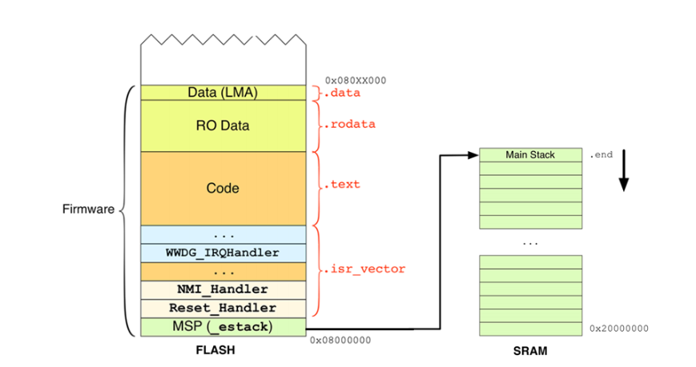

## 00: Set up IDE - Build & Flash file code bằng thanh ghi cho STM32F1, không sử dụng thư viện, bare-metal

### 1. Cài đặt các trình biên dịch cần thiết

#### a) GNU - ARM & OpenOCD

- Biên dịch file .c thành file -o thích hợp với vi xử lý ARM

https://developer.arm.com/downloads/-/gnu-rm

- Nạp code thông qua Stlink, Debug 

https://github.com/xpack-dev-tools/openocd-xpack/releases/tag/v0.12.0-6/

- Sau khi tải về copy đường dẫn chứa file exe và paste vào Path của Environment variables

### 2. Các file cần thiết

**ARM Cotex M bắt đầu từ địa chỉ 0x08000000 -> Tìm VectorTbale VTOR -> Nhảy đến Reset_Handler**

- `startup_stm32f103.s`: Để 1 chương trình main.c có thể chạy được trên vi điều khiển, ta cần cấu hình theo thứ tự ở file này

  - Định nghĩa Vector Table VTOR (Stack Pointer, danh sách các hàm ngắt ISR, địa chỉ Reset Handler và các địa chỉ của Handler khác)

  - Handler xử lý ngắt mặc định nếu các ngắt không được định nghĩa, ví dụ ngắt UART chưa đc định nghĩa thì tự động chạy ngắt mặc định `Default_Handler`

  - Xác định `Reset_Handler`: Hàm đầu tiên chạy sau khi Reset, copy .data từ FLASH vào SRAM, clear vùng .bss (các biến chưa đc khởi tạo thì = 0)

  - Chạy hàm `main()`

- `stm32f103.ld`: Quy định bố trí bộ nhớ cho Flash, SRAM của 1 chương trình embedded firmware chạy trên ARM

- `makefile`: định nghĩa các lệnh để build chương trình nhanh hơn, `all flash clean`