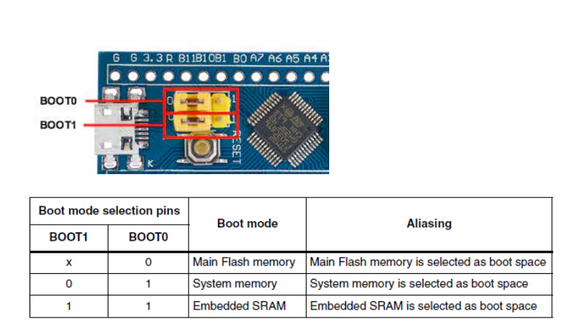

## Boot Process

- VDK STM32F1 có 2 jumper cho phép người sử dụng lựa chọn nơi thực thi chương trình sau khi Reset

- Thông thường BOOT1 = BOOT0 = 0 -> sau khi khởi động, VDK tìm đến vùng nhớ Flash và chạy nó

- Mỗi khi CPU reset, PC nhảy đến địa chỉ bắt đầu (với boot 0-0 là thực thi vùng nhớ tại Flash, PC-> 0x08000000) , đây là vị trí lưu chương trình bootloader. vì vậy chương trình này sẽ được chạy đầu tiên.

Reset → Load SP → Load PC → Reset_Handler → SystemInit() → init
.data/.bss → main()

- Nạp giá trị ô nhớ đầu tiên của VTOR vào MSP

- Lấy địa chỉ của Reset_Handler được đặt trong ô nhớ thứ 2 của VTOR, load vào PC để thực hiện (systemint() -> khởi tạo data/bss -> chạy main())

